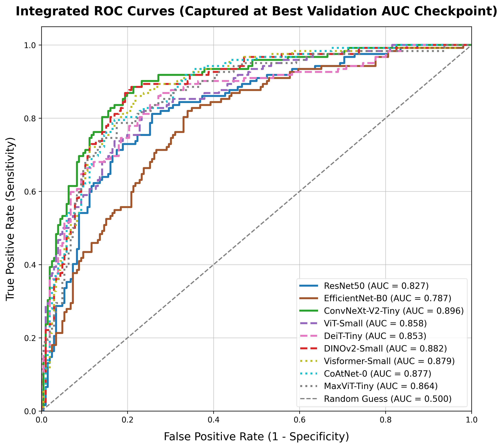
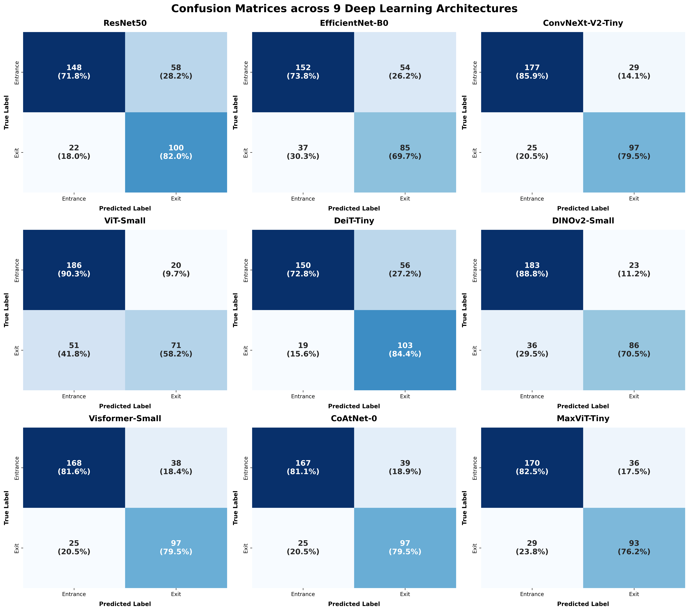
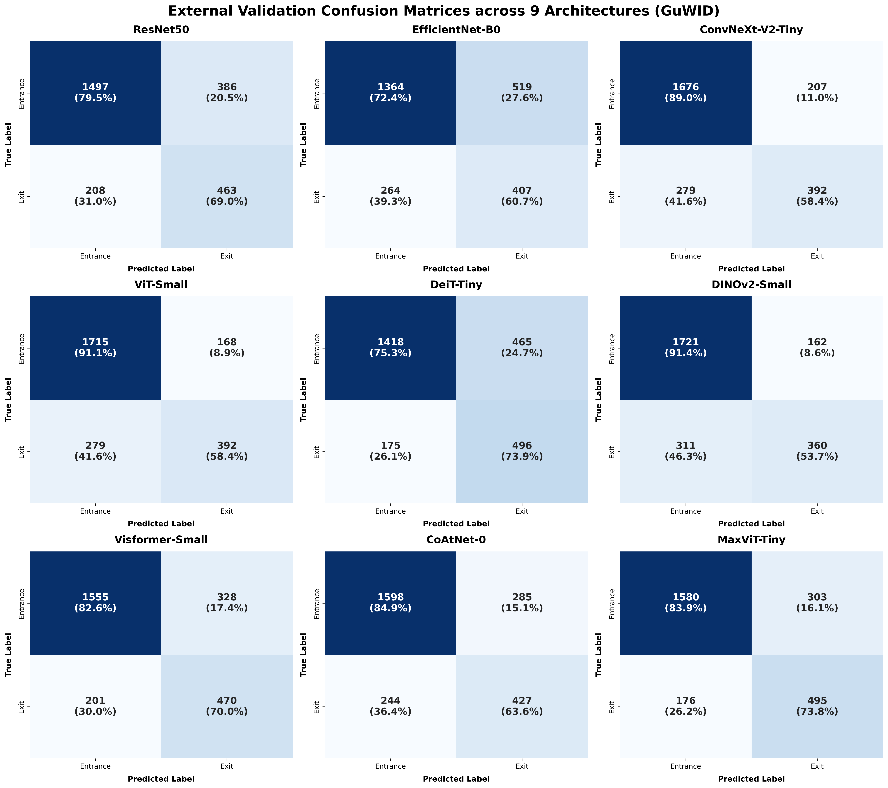

# CCMEO Gunshot Wound Image Analysis AI Benchmarking: Entrance vs. Exit Wound Classification
Advanced deep learning benchmark study evaluating Convolutional Neural Network-based (CNN), Vision Transformer-based (ViT), and CNN-ViT Hybrid SOTA Architectures on forensic pathology datasets at the Cook County Medical Examiner's Office (CCMEO) with Large-Scale External Validation on the GuWID-UnB Dataset.

---

## 📌 Project Overview

### 💡 Quick & Easy Summary
> 🔍 **"Which image analysis AI model is the smartest at distinguishing a bullet's entrance wound from its exit wound?"**
> 
> This repository presents a comprehensive **AI Performance Exam (Benchmark Study)** that I designed to answer that exact question for forensic pathology. 
> 
> I personally configured, trained, and evaluated 9 established Image AI models using real-world, certified autopsy photography from the **Cook County Medical Examiner's Office (CCMEO)**. Then, to test their true diagnostic adaptability, I challenged them with a completely blind "Final Exam" using the independent **GuWID-UnB dataset** (constructed by Renato Queiroz Nogueira Lira et al., in collaboration with the University of Brasília and other institutions). 
> 
> **Why this setup?** If a model trained on CCMEO data can still successfully classify images from an entirely different dataset (with different lighting, cameras, and backgrounds), it proves that the AI is not just "cheating" by memorizing site-specific photography styles. Instead, it demonstrates that the AI has truly learned to analyze the universal, authentic pathological features of gunshot wounds. This benchmarking strategy allows me to objectively evaluate and rank how well these models generalize to real-world forensic environments across different institutions.

In forensic pathology, distinguishing between **Entrance Wounds** and **Exit Wounds** is a critical task for reconstructing shooting incidents, determining bullet trajectories, and providing medical-legal testimony. 

This repository implements and benchmarks 9 state-of-the-art computer vision architectures, divided into **3 different algorithmic approaches to image recognition**: **Convolutional Neural Networks (CNN)**, **Vision Transformers (ViT)**, and **CNN-ViT Hybrid models**. The goal of this study is to evaluate their capacity to automate and objectively analyze morphology patterns in gunshot wound trauma. Leveraging pure PyTorch and `timm`, all models were evaluated on high-resolution forensic autopsy datasets from the CCMEO and further stress-tested via large-scale external validation to verify real-world algorithmic safety and robustness against severe domain shifts.

---

## 📊 Dataset Specification & Splitting Strategy
The core foundation of this benchmark relies on high-resolution, certified forensic photography meticulously annotated at the Cook County Medical Examiner's Office (CCMEO). 

### 🔍 Cohort Overview
* **Temporal Range:** Data compiled continuously from **2023 to 2026**.
* **Total Enrolled Cohort:** **315 distinct forensic autopsy cases** presenting with firearm trauma.
* **Total Compiled Dataset:** **1,639 high-resolution images**

### ✂️ Manual ROI Extraction & Artifact Elimination (Preventing AI "Cheating")
> 💡 **Why this process matters:** AI models are notoriously "lazy" copycats. If an autopsy photo contains a case number tag, a specific hospital setting, or surgical sutures, the AI might simply memorize those artificial shortcuts to pass the exam instead of actually evaluating the wound. 
> 
> To block this, I spent hours manually cropping every single image into a strict 1:1 square aspect ratio (Region of Interest - ROI), forcing the artificial brain to learn authentic, universal pathological features purely from the wound itself.

During this meticulous manual extraction process, the following confounding variables were strictly excluded from the frame:
* **Eliminated Elements:** Autopsy case number tags, surgical sutures, visible bullets or projectiles lodged near the wound, and non-cutaneous background environments.

### 🔄 Data Partitioning Matrix (Strict Case-Independence)
To ensure absolute empirical integrity, the dataset was strictly partitioned at a rigorous case-independent level. This guarantees that all images originating from a single forensic case are restricted entirely to either the Training set or the Validation set, with zero cross-contamination.

> 💡 **Why this partition matters (Preventing Data Leakage)?** 
> Imagine a single forensic case (Patient A) has 5 different photos taken from slightly different angles or under the same lighting. If I randomly split these photos—putting 4 into the Training set and 1 into the Validation set—the AI will easily get a perfect score on Patient A's testing photo. 
> 
> Why? Not because it genuinely understands gunshot wounds, but simply because it recognizes Patient A's specific skin tone, body location, or the unique lighting of that specific autopsy room. 
> 
> By locking all images of a single patient onto one side of the fence, I ensure a truly honest and rigorous test: the AI is forced to judge a patient it has never, ever seen before.

| Wound Category | Total Images | Training Set | Validation Set |
| :--- | :---: | :---: | :---: |
| **Entrance Wounds** | 979 | 773 | 206 |
| **Exit Wounds** | 660 | 538 | 122 |
| **Combined Total** | **1,639** | **1,311** | **328** |

### ⚖️ Adjusting for Data Imbalance (Weighted Loss)
In this dataset, there are naturally more entrance wound images (979) than exit wound images (660). If left unaddressed, an AI model can easily become biased toward the majority class (entrance wounds), leading to a higher rate of false negatives for exit wounds. 

To ensure completely unbiased and fair diagnostic training, I applied a statistical correction to the loss function (`nn.CrossEntropyLoss`).

> 💡 **Why this mathematical weight matters?**
> Imagine an AI taking a 100-question exam where **80 questions are Entrance Wounds** and **only 20 are Exit Wounds**. A lazy AI could simply guess "Entrance" for every single question without studying at all, and it would still score a deceptive 80%. 
> 
> To balance the scales in this hypothetical exam, we must mathematically make the rarer questions more valuable: since Entrance wounds outnumber Exit wounds by **4 to 1 (80:20)**, misclassifying a rare Exit wound should carry a **4.0x higher penalty**.
> 
> **Applying this to my actual dataset:** 
> My real-world training set contains **773 Entrance Wounds** and **538 Exit Wounds**. To find the exact fair penalty, I calculated the inverse ratio of the classes:
> 
> $$\text{Penalty Weight for Exit Wounds} = \frac{773 \text{ (Entrance Images)}}{538 \text{ (Exit Images)}} \approx 1.48$$
> 
> By assigning this precise **1.48x higher penalty weight** whenever the model misclassifies a scarcer exit wound, the AI is effectively punished for ignoring the minority class. This actively forces the artificial brain to study the unique, subtle morphological features of both wound types with equal clinical importance.
---

## 🔬 External Validation Cohort (GuWID-UnB Dataset)
To stress-test the domain generalization limits and prevent source-dataset bias, we introduced the completely independent **Gunshot Wound Image Database (GuWID)**. This dataset was constructed as part of the study titled *"Deep Learning-Based Human Gunshot Wounds Classification"* by Renato Queiroz Nogueira Lira et al., in collaboration with the University of Brasília (UnB) and other institutions. The benchmark dataset is officially accessible via their public repository: [pedrogarciafreitas/GuWID-UnB](https://github.com/pedrogarciafreitas/GuWID-UnB).

Serving as a rigorous external "Final Exam," this out-of-distribution (OOD) cohort challenges the models across severe demographic shifts, distinct photography setups, and varied lesion-acquisition protocols.

| Wound Category (GuWID External Evaluation Cohort) | Total Images |
| :--- | :---: |
| **Entrance Wounds** | **1,883 images** |
| **Exit Wounds** | **671 images** |
| **Combined Total (Robustness Stress-Test)** | **2,554 images** |

* **Scale Contrast:** The external testing cohort (**2,554 images**) is significantly larger than the internal validation subset (**328 images**), providing immense statistical power to evaluate true real-world diagnostic performance and algorithmic clinical safety across distinct institutional frameworks.

---

## 🔬 Evaluated Model Lineup (9 Architectures)
Nine diverse deep learning backbones across three architectural families were trained and optimized using dynamic image resolutions matching their pre-trained infrastructures:

* **CNN Family (Solid Lines):** ResNet50, EfficientNet-B0, ConvNeXt-V2-Tiny
* **Vision Transformer Family (Dashed Lines):** ViT-Small, DeiT-Tiny, DINOv2-Small (Self-Supervised)
* **Hybrid CNN-ViT Family (Dotted Lines):** Visformer-Small, CoAtNet-0, MaxViT-Tiny

---

## 📊 Benchmarking Performance Metrics
All 9 vision architectures were trained for a fixed duration of **20 full epochs**. To secure the most robust and clinically optimal checkpoint, the definitive weight files were extracted from the precise training epoch where the framework achieved its **Peak Validation ROC-AUC** score. 

Below are the comparative performance matrices captured under this empirical strategy.

### 📝 Internal Validation (CCMEO Dataset)
Performance quantified via full fine-tuning on the case-independent internal validation partition.

| Rank | Model Name | Model Family | Accuracy | Precision | Recall (Sens.) | F1-Score | **Peak Validation ROC-AUC** | Peak Epoch |
| :---: | :--- | :---: | :---: | :---: | :---: | :---: | :---: | :---: |
| 1 | **ConvNeXt-V2-Tiny** | CNN | 0.8354 | 0.7698 | 0.7951 | 0.7823 | **0.8959** | Ep 10 |
| 2 | **DINOv2-Small** | ViT | 0.8201 | 0.7890 | 0.7049 | 0.7446 | **0.8821** | Ep 12 |
| 3 | **Visformer-Small** | Hybrid | 0.8079 | 0.7185 | 0.7951 | 0.7549 | **0.8792** | Ep 6 |
| 4 | CoAtNet-0 | Hybrid | 0.8049 | 0.7132 | 0.7951 | 0.7519 | 0.8767 | Ep 4 |
| 5 | ViT-Small | ViT | 0.7835 | 0.7802 | 0.5820 | 0.6667 | 0.8578 | Ep 12 |
| 6 | MaxViT-Tiny | Hybrid | 0.8018 | 0.7209 | 0.7623 | 0.7410 | 0.8638 | Ep 11 |
| 7 | DeiT-Tiny | ViT | 0.7713 | 0.6478 | 0.8443 | 0.7331 | 0.8532 | Ep 9 |
| 8 | ResNet50 *(Baseline)* | CNN | 0.7561 | 0.6329 | 0.8197 | 0.7143 | 0.8265 | Ep 17 |
| 9 | EfficientNet-B0 | CNN | 0.7226 | 0.6115 | 0.6967 | 0.6513 | 0.7871 | Ep 20 |

### 🔍 External Validation (GuWID-UnB Dataset - Out-of-Distribution)
Robustness check on completely independent data (2,554 images) with cross-validation ranking and directional performance gap analysis ($\Delta$ ROC-AUC = External AUC - Internal AUC).

| Rank | Model Name | Model Family | Accuracy | Precision | Recall (Sens.) | F1-Score | **External ROC-AUC** | **$\Delta$ ROC-AUC** |
| :---: | :--- | :---: | :---: | :---: | :---: | :---: | :---: | :---: |
| 1 | **MaxViT-Tiny** | Hybrid | 0.8125 | 0.6203 | **0.7377** | **0.6739** | **0.8577** | $-0.0061$ |
| 2 | **ViT-Small** | ViT | **0.8250** | **0.7000** | 0.5842 | 0.6369 | **0.8550** | $-0.0028$ |
| 3 | **ConvNeXt-V2-Tiny** | CNN | 0.8097 | 0.6544 | 0.5842 | 0.6173 | 0.8467 | $-0.0492$ |
| 4 | Visformer-Small | Hybrid | 0.7929 | 0.5890 | 0.7004 | 0.6399 | 0.8438 | $-0.0354$ |
| 5 | CoAtNet-0 | Hybrid | 0.7929 | 0.5997 | 0.6364 | 0.6175 | 0.8310 | $-0.0457$ |
| 6 | **DINOv2-Small** | ViT | 0.8148 | 0.6897 | 0.5365 | 0.6035 | 0.8304 | $-0.0517$ |
| 7 | ResNet50 *(Baseline)* | CNN | 0.7674 | 0.5453 | 0.6900 | 0.6092 | 0.8248 | $-0.0017$ |
| 8 | DeiT-Tiny | ViT | 0.7494 | 0.5161 | 0.7392 | 0.6078 | 0.8248 | $-0.0284$ |
| 9 | EfficientNet-B0 | CNN | 0.6934 | 0.4395 | 0.6066 | 0.5097 | 0.7322 | $-0.0549$ |

### 🔑 Key Takeaways & Robustness Generalization Analysis

1. **Elite Large-Scale Generalization:** Modern architectures exhibited outstanding domain stability. Even when evaluated on a massive, completely unseen external dataset of **2,554 images (GuWID-UnB)**, the top-performing **MaxViT-Tiny** and **ViT-Small** models maintained robust discriminative capacity, scoring **ROC-AUCs of 0.8577 and 0.8550** respectively.
2. **The Discrepancy of Internal Champions (ConvNeXt-V2 vs. DINOv2):** While **ConvNeXt-V2-Tiny** (Internal Rank #1) and **DINOv2-Small** (Internal Rank #2) dominated internal validation, they suffered noticeable performance drops when exposed to the GuWID-UnB OOD shift. 
   * *ConvNeXt-V2's Locality Bias:* Despite being a modernized CNN, its strong *inductive bias for local textures* overfitted to site-specific variables (CCMEO photography gear, ambient lighting conditions, specific cutaneous resolution), resulting in a performance drop ($\Delta$ AUC: $-0.0492$) and falling to 3rd place.
   * *DINOv2's Pre-training Bias:* DINOv2's massive self-supervised foundation weights carry a strong bias toward *everyday natural images (animals, scenery, everyday objects)*. While it segmented internal wounds efficiently, it tended to overfit to non-forensic macro-features, leading to the largest performance degradation among SOTA models ($\Delta$ AUC: $-0.0517$, dropping to 6th place) under severe demographic and camera property shifts.
3. **The Hybrid & Pure ViT Generalization Triumph:**
   In contrast, **MaxViT-Tiny** achieved the highest external validation AUC (0.8577, Rank #1) with minimal decay ($\Delta$ AUC: $-0.0061$). Its stacked grid-attention architecture seamlessly fuses local CNN features with global context layers, neutralizing site-specific noise. Similarly, **ViT-Small** (Rank #2) demonstrated the absolute minimal performance gap ($\Delta$ AUC of only $-0.0028$) because its non-local *global attention mechanism* looks past micro-pixel variations and directly focuses on the invariant, macro-geometric architecture of gunshot wounds (e.g., circular abrasion margins vs. irregular lacerated tears).
4. **The CNN Brittleness Discovery:** While light CNN frameworks like **EfficientNet-B0** performed acceptably during internal validation, they collapsed under the massive 2,554-image GuWID-UnB dataset (AUC dropping down to **0.7322**, $\Delta$ AUC: $-0.0549$), highlighting that classic standard CNNs suffer from critical spatial distribution over-fitting. This discovery underscores the absolute necessity of moving toward Transformer-based Global Context architectures in modern computational forensics.

---

## 📈 Visualizations & Analytical Assets

### 1. Validation AUC Trajectory Across 20 Epochs
The training history maps the longitudinal convergence behavior of the 9 architectures. Starred markers ($\star$) denote the precise peak where checkpoints were extracted, along with labeled raw AUC values. Modern Hybrid architectures (MaxViT, CoAtNet) and Transformer backbones establish elite representation stability over pure standard CNNs.

### 2. Integrated ROC Curves (Internal vs. External Validation)
The Receiver Operating Characteristic (ROC) curves illustrate discriminative performance. While standard CNN backbones like EfficientNet-B0 experience severe performance degradation when shifted to the GuWID-UnB dataset, Hybrid and ViT networks maintain strong generalization bounds, proving their robust global context capacity.

#### Internal ROC Curve (CCMEO)

#### External ROC Curve (GuWID-UnB)

### 3. Multi-Architecture Confusion Matrices (3x3 Grid Layout)
A complete 3x3 grid layout mapping out the exact classification distribution (True vs. Predicted Labels) across all 9 models. Cell values display raw sample counts alongside percentage ratios to reveal precise directional error tendencies under severe domain shifts.

#### Internal Confusion Matrix Grid (CCMEO)

#### External Confusion Matrix Grid (GuWID-UnB)

### 4. Explainable AI (XAI): Visualizing AI Diagnostic Focus (Grad-CAM)
To guarantee that the AI relies on genuine pathological features rather than background artifacts, Grad-CAM visual heatmaps highlight the exact pixel regions our top models focused on during final classification.

* **Entrance Wound Analysis:** The top-performing networks precisely target the **Abrasion Collar** surrounding the wound margin. This high-density focus perfectly mirrors the standard diagnostic criteria found in forensic medicine textbooks.
* **Exit Wound Analysis:** The visual heatmaps shift away from neat borders and highlight the irregular, **Lacerated Margins** and structural skin flaps, proving that the models rely on true morphological trauma features to make an objective determination.

---

## 🛠️ Environment & Requirements
* Python 3.10+
* PyTorch 2.0+ (CUDA enabled)
* `timm` (Torch Image Models)
* scikit-learn, matplotlib, seaborn, opencv-python, pandas, openpyxl
