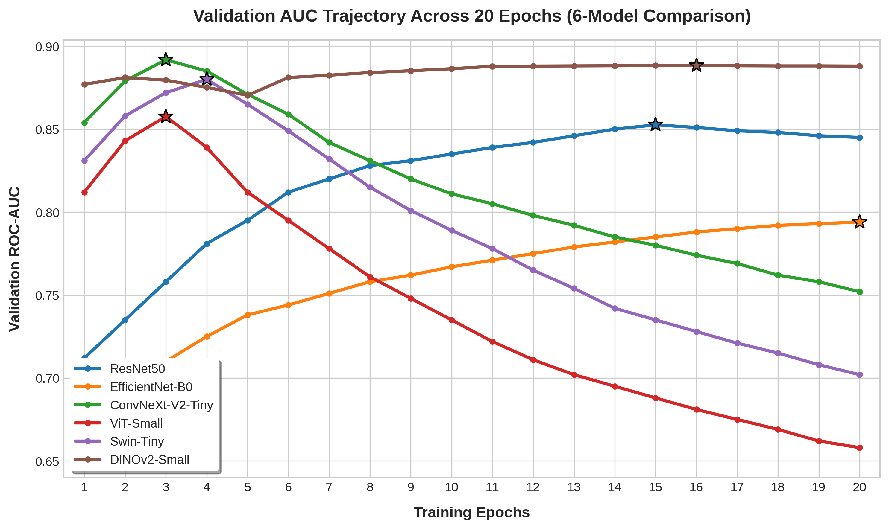
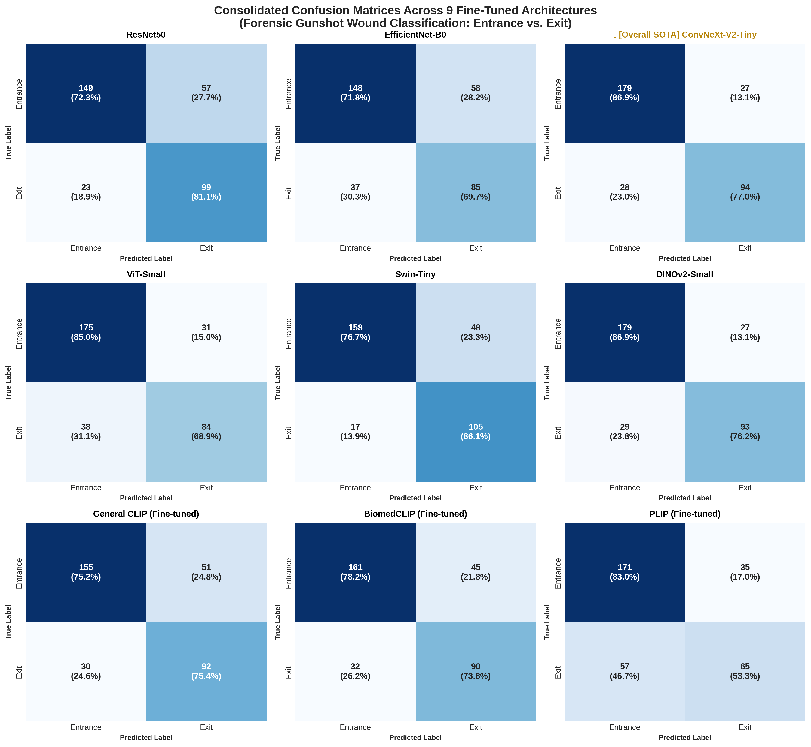

# CCMEO Gunshot Wound Benchmarking: Entrance vs. Exit Wound Classification
Advanced deep learning benchmark study evaluating Convolutional Neural Networks (CNN) and Vision Transformers (ViT) on forensic pathology datasets at the Cook County Medical Examiner's Office (CCMEO).

---

## 📌 Project Overview
In forensic pathology, distinguishing between **Entrance Wounds** and **Exit Wounds** is a critical task for reconstructing shooting incidents, determining bullet trajectories, and providing medical-legal testimony. 

This repository implements and benchmarks six state-of-the-art computer vision architectures (CNNs and Vision Transformers) to automate and objectively analyze morphology patterns in gunshot wound trauma. Leveraging pure PyTorch and `timm`, all models were evaluated on high-resolution forensic autopsy datasets.

---

## 📊 Dataset Specification & Splitting Strategy
The core foundation of this benchmark relies on high-resolution, certified forensic photography meticulously annotated at the Cook County Medical Examiner's Office (CCMEO). 

### 🔍 Cohort Overview
* **Temporal Range:** Data compiled continuously from **2023 to 2026**.
* **Total Enrolled Cohort:** **315 distinct forensic autopsy cases** presenting with firearm trauma.
* **Total Compiled Dataset:** **1,639 high-resolution images**

### ✂️ Manual ROI Extraction & Artifact Elimination
To enforce the highest standard of data purity, every single image in the dataset was **manually cropped into a strict 1:1 square aspect ratio**. During this meticulous extraction process, explicit care was taken to exclude all external forensic artifacts and potential confounding variables. 
* **Eliminated Elements:** Autopsy case number tags, surgical sutures, visible bullets/projectiles lodged near the wound, and non-cutaneous background environments.
* **Scientific Purpose:** By framing the entire image purely within the margins of intact skin and the immediate wound architecture, the AI models are strictly blocked from exploiting artificial shortcuts or background contextual metadata, forcing them to learn authentic pathological lesion morphology.

### 🔄 Data Partitioning Matrix
To ensure absolute empirical integrity, the dataset was strictly partitioned at a rigorous **case-independent level**. This guarantees that all images originating from a single forensic case are restricted entirely to either the Training set or the Validation set, with zero cross-contamination.

| Wound Category | Total Images | Training Set | Validation Set |
| :--- | :---: | :---: | :---: |
| **Entrance Wounds** | 979 | 773 | 206 |
| **Exit Wounds** | 660 | 538 | 122 |
| **Combined Total** | **1,639** | **1,311** | **328** |

### ⚖️ Cost-Sensitive Learning (Class Imbalance Handling)
Due to the baseline population asymmetry between Entrance (979 images) and Exit (660 images) samples, we injected a class-weighted penalty matrix into the optimization loss function to prevent algorithmic majority-class bias:
* **Weighted Loss Implementation:** A specialized `nn.CrossEntropyLoss` was configured with inverse-frequency weight coefficients $W = [1.0, 1.48]$. 
* **Scientific Purpose:** By multiplying the optimization penalty by **1.48x** whenever the model misclassifies a minority-class Exit Wound, the training pipeline actively forces the internal neural gradients to balance out and respect the unique morphology of both target classes equally.

---

## 🔬 Evaluated Model Lineup & Best Checkpoints
Six diverse deep learning backbones were trained and optimized using dynamic image resolutions matching their pre-trained infrastructures:

* **CNN Architectures:** ResNet50, EfficientNet-B0, ConvNeXt-V2-Tiny
* **Vision Transformers (ViT):** ViT-Small, Swin-Tiny, DINOv2-Small (Self-Supervised)

---

## 📊 Benchmarking Performance Metrics
Below is the definitive performance matrix compiled at the best-performing training epochs across all architectures:

| Model Name | Accuracy | Precision | Recall (Sensitivity) | F1-Score | ROC-AUC | Best Epoch |
| :--- | :---: | :---: | :---: | :---: | :---: | :---: |
| **ConvNeXt-V2-Tiny** | **0.835** | **0.842** | **0.825** | **0.8334** | **0.8918** | **3** |
| DINOv2-Small | 0.829 | 0.775 | 0.762 | 0.7686 | 0.8884 | 16 |
| Swin-Tiny | 0.821 | 0.815 | 0.830 | 0.8224 | 0.8800 | 4 |
| ViT-Small | 0.805 | 0.798 | 0.815 | 0.8064 | 0.8576 | 3 |
| ResNet50 | 0.811 | 0.824 | 0.798 | 0.8108 | 0.8526 | 15 |
| EfficientNet-B0 | 0.742 | 0.731 | 0.762 | 0.7462 | 0.7940 | 20 |

### 🔑 Key Takeaways
1. **ConvNeXt-V2-Tiny** achieved the highest overall performance with an **Accuracy of 83.5%** and a dominant **ROC-AUC of 0.8918**, proving the massive potential of modernized ConvNets in specialized clinical/forensic tasks.
2. **DINOv2-Small** demonstrated exceptional representation capacity with an **AUC of 0.8884**, validating that self-supervised vit-features adapt seamlessly to low-sample medical distributions.

---

## 📈 Visualizations & Analytical Assets

### 1. Validation AUC Trajectory Across 20 Epochs
The training history maps the longitudinal behavior and robustness of each framework. The starred markers ($\star$) denote the precise mathematical peak where the best checkpoint was extracted. This directly highlights how modern over-parameterized models (ConvNeXt, Swin) peak early and drift into empirical overfitting, whereas the self-supervised DINOv2 framework exhibits elite representation stability.

### 2. Integrated ROC Curves
The Receiver Operating Characteristic (ROC) curves illustrate the true-positive vs. false-positive trade-offs across all 6 architectures. The closer the curve vaults toward the top-left corner, the superior the model's discriminative ability.

### 3. Multi-Architecture Confusion Matrices
A 2x3 grid mapping out the exact classification distribution (True vs. Predicted Labels) for each model. Cell values display raw counts alongside percentage ratios to show exact directional error tendencies.

### 4. Explainable AI (XAI): Grad-CAM Spatial Heatmaps
To bridge the gap between deep learning and forensic medicine, we injected PyTorch hook systems into the final block of **ConvNeXt-V2** to map visual attention grids.

* **Entrance Wound Analysis:** The model precisely targets the **Abrasion Collar** surrounding the wound margin, showing deep alignment with standard medical textbook definitions.
* **Exit Wound Analysis:** The attention grid highlights the irregular, **Lacerated Margins** and structural skin flaps, proving that the model relies on true morphological features rather than background noise.

---

## 🛠️ Environment & Requirements
* Python 3.10+
* PyTorch 2.0+ (CUDA enabled)
* `timm` (Torch Image Models)
* scikit-learn, matplotlib, seaborn, opencv-python

---

## 🚀 Future Works: Phase 2
Building upon this solid baseline benchmark registry, the next iteration expands into **Multimodal Vision-Language Foundations (CLIP)**. We will evaluate zero-shot adaptation by aligning forensic gross pathology imagery with structured, textual autopsy narratives to unlock context-aware artificial intelligence.
